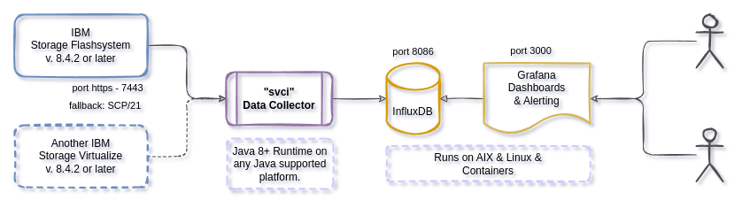

# Spectrum Virtualize Insights

**SVCi** is a utility that collects metrics from one or more *IBM SAN Volume Controllers*. The metric data is processed and saved into an InfluxDB time-series database. Grafana is used to visualize the metrics data from InfluxDB through provided dashboards, or your own customized dashboards.

This software is free to use and is licensed under the [Apache 2.0 License](LICENSE), but is not supported or endorsed by International Business Machines (IBM).



Some of my other related projects are:

- [hmci](https://git.data.coop/nellemann/hmci) for agent-less monitoring of IBM Power servers
- [sysmon](https://git.data.coop/nellemann/sysmon) for monitoring all types of servers with a small Java agent
- [syslogd](https://git.data.coop/nellemann/syslogd) for redirecting syslog and GELF to remote logging destinations


## Screenshots


## Installation and Setup

There are few steps in the installation.

1. Prepare your Spectrum Virtualize
2. Installation of InfluxDB and Grafana software
3. Installation and configuration of *SVC Insights* (SVCi)
4. Configure Grafana and import example dashboards

### 1 - Prepare Spectrum Virtualize

- Create a user with the "Monitor" role

### 2 - InfluxDB and Grafana Installation

Install InfluxDB (v. **1.8.x** or **1.9.x** for best compatibility with Grafana) on a host which is network accessible by the SVCi utility (the default InfluxDB port is 8086). You can install Grafana on the same server or any server which are able to connect to the InfluxDB database. The Grafana installation needs to be accessible from your browser (default on port 3000). The default settings for both InfluxDB and Grafana will work fine as a start.

- You can download [Grafana ppc64le](https://www.power-devops.com/grafana) and [InfluxDB ppc64le](https://www.power-devops.com/influxdb) packages for most Linux distributions and AIX on the [Power DevOps](https://www.power-devops.com/) site.
- Binaries for amd64/x86 are available from the [Grafana website](https://grafana.com/grafana/download) (select the **OSS variant**) and [InfluxDB website](https://portal.influxdata.com/downloads/) and most likely directly from your Linux distributions repositories.
- Create the empty *svci* database by running the **influx** CLI command and type:

```text
CREATE DATABASE "svci" WITH DURATION 365d REPLICATION 1;
```

See the [Influx documentation](https://docs.influxdata.com/influxdb/v1.8/query_language/manage-database/#create-database) for more information on duration and replication.

### 3 - SVCi Installation & Configuration

Install *SVCi* on a host, that can connect to your SAN Volume Controllers (on port 7443), and is also allowed to connect to the InfluxDB service. This *can be* the same LPAR/VM as used for the InfluxDB installation.

- Ensure you have **correct date/time** and NTPd running to keep it accurate!
- The only requirement for **svci** is the Java runtime, version 8 (or later)
- Install **SVCi** from from [packages](https://git.data.coop/nellemann/-/packages/generic/svci/) (rpm, deb or jar) or build from source
  - On RPM based systems: ```sudo rpm -ivh svci-x.y.z-n.noarch.rpm```
  - On DEB based systems: ```sudo dpkg -i svci_x.y.z-n_all.deb```
- Copy the **/opt/svci/doc/svci.toml** configuration example into **/etc/svci.toml** and edit the configuration to suit your environment. The location of the configuration file can optionally be changed with the *--conf* option.
- Run the **/opt/svci/bin/svci** program in a shell, as a @reboot cron task or configure as a proper service - there are instructions in the [doc/](doc/) folder.
- When started, *svci* expects the InfluxDB database to exist already.

### 4 - Grafana Configuration

- Configure Grafana to use InfluxDB as a new datasource
  - **NOTE:** set *Min time interval* depending on your SVCi *refresh* setting.
- Import example dashboards from [doc/dashboards/*.json](doc/dashboards/) into Grafana as a starting point and get creative making your own cool dashboards - please share anything useful :)

## Notes

### No data (or past/future data) shown in Grafana

This is most likely due to timezone, date and/or NTP not being configured correctly on the SAN Volune Controller and/or host running SVCi.

### Start InfluxDB and Grafana at boot (systemd compatible Linux)

```shell
systemctl enable influxdb
systemctl start influxdb

systemctl enable grafana-server
systemctl start grafana-server
```

### InfluxDB Retention Policy

Examples for changing the default InfluxDB retention policy for the svci database:

```text
ALTER RETENTION POLICY "autogen" ON "svci" DURATION 156w
ALTER RETENTION POLICY "autogen" ON "svci" DURATION 90d
```

### Upgrading SVCi

On RPM based systems (RedHat, Suse, CentOS), download the latest *svci-x.y.z-n.noarch.rpm* file and upgrade:
```shell
sudo rpm -Uvh svci-x.y.z-n.noarch.rpm
```

On DEB based systems (Debian, Ubuntu and derivatives), download the latest *svci_x.y.z-n_all.deb* file and upgrade:
```shell
sudo dpkg -i svci_x.y.z-n_all.deb
```

Restart the SVCi service on *systemd* based Linux systems:

```shell
systemctl restart svci
journalctl -f -u svci  # to check log output
```


### AIX Notes

To install (or upgrade) on AIX, you need to pass the *--ignoreos* flag to the *rpm* command:

```shell
rpm -Uvh --ignoreos svci-x.y.z-n.noarch.rpm
```


## Screenshots

Screenshots of the provided Grafana dashboard can be found in the [doc/screenshots/](doc/screenshots) folder.


## Known problems


## Development Information

You need Java (JDK) version 8 or later to build svci.


### Build & Test

Use the gradle build tool, which will download all required dependencies:

```shell
./gradlew clean build
```

### Local Testing

#### InfluxDB

Start the InfluxDB container:

```shell
docker run --name=influxdb --rm -d -p 8086:8086 influxdb:1.8
```

Create the *svci* database:

```shell
docker exec -i influxdb influx -execute "CREATE DATABASE svci"
```


#### Grafana

Start the Grafana container, linking it to the InfluxDB container:

```shell
docker run --name grafana --link influxdb:influxdb --rm -d -p 3000:3000 grafana/grafana
```

Setup Grafana to connect to the InfluxDB container by defining a new datasource on URL *http://influxdb:8086* named *svci*.


Grafana dashboards can be imported from the *doc/dashboards/* folder.
